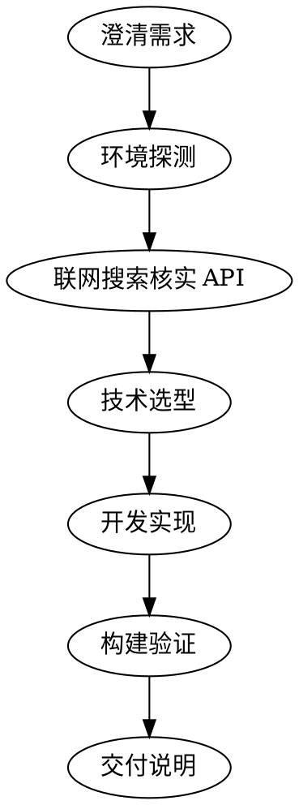

# Harmony 动效与视效应用快速开发

## Overview

在 HarmonyOS（鸿蒙 NEXT / 5.x）上用 ArkTS + ArkUI 快速开发动效（动画）与视效（视觉特效）应用。

**核心原则：先搜索，后编码（Search First, Code Second）。**

为什么：HarmonyOS NEXT 的 API 迭代非常快（每年多个 API 版本），动画与图形相关接口经历了
`@ohos.*` → `@kit.*` 的命名空间迁移，部分旧接口被废弃或改名。模型记忆中的 API 很可能已过时——
直接使用会导致编译失败或用到废弃接口。每次开发前必须联网核实当前最新 API。

## Workflow



### Step 0 — 澄清需求

确认三件事（缺失时问用户，不要猜）：

1. **效果类型**：入场/点击反馈动画？粒子？转场？自绘？3D？滤镜/着色器？
2. **工程形态**：从零创建完整 DevEco Studio 工程，还是在已有工程中增量添加页面/组件？
3. **目标设备与版本**：手机/平板/折叠屏？用户是否指定了最低 API 版本（compileSdkVersion / compatibleSdkVersion）？

### Step 1 — 环境探测

检查本机构建能力，决定验证策略：

```bash
which hvigorw ohpm hdc node 2>/dev/null
ls /Applications/DevEco-Studio.app 2>/dev/null && echo "DevEco Studio installed"
```

- **有 hvigorw + SDK** → 开发完成后走命令行编译验证（见 Step 4）。
- **只有 DevEco Studio** → 生成工程后指导用户在 DevEco Studio 中打开、用 Previewer 预览。
- **都没有** → 只保证代码结构与语法正确，交付时明确告知用户如何安装工具链验证。

### Step 2 — 联网搜索核实 API（关键步骤，不可跳过）

对选型涉及的每个关键 API，用 web_search / web_fetch 核实：

1. **API 是否存在于当前版本**、所属模块（`@kit.ArkUI`？`@ohos.*`？）、起始版本与废弃状态；
2. **官方示例代码**（华为官方文档均带 ArkTS 示例，优先采信官方示例的写法）；
3. **版本差异**：搜索结果注明 API 版本文档（如"API 12 参考"），与工程目标版本对齐。

信息源、URL 模式与搜索关键词见 **references/search-sources.md**（搜索前必读）。

搜索原则：
- 中英文关键词都试：如「鸿蒙 粒子动画 Particle」和「HarmonyOS particle animation ArkUI」；
- 采信优先级：**gitee.com/openharmony/docs 官方文档（纯 Markdown，可 curl 直读）≥ developer.huawei.com 官方文档 > gitcode 官方示例 > 博客/论坛**；
- 博客与论坛内容必须与官方文档交叉验证后再用——过时博客是鸿蒙开发最大的坑；
- 找不到当前版本的官方文档时，明确告诉用户「该 API 可能已废弃或改名」，并给出替代方案，不要硬写。

### Step 3 — 技术选型

按需求类型选择技术路线（详细能力与代码模式见对应 reference 文件）：

| 需求 | 首选技术 | 参考文件 |
|---|---|---|
| 点击反馈、位移/缩放/透明度/颜色变化 | `getUIContext().animateTo` / `animation` 属性 / `keyframeAnimateTo` | references/arkui-animation.md |
| 复杂时序、逐帧控制、可暂停动画（如封面旋转） | `getUIContext().createAnimator` 帧动画 | references/arkui-animation.md |
| 雨/雪/烟花/点赞爆发等粒子效果 | `Particle` 组件（注意：不是旧名 ParticleSystem） | references/arkui-animation.md |
| 页面进出场转场 | Navigation 体系（NavPathStack / NavDestination customTransition） | references/arkui-animation.md |
| 组件出现/消失过渡、跨页面共享元素（一镜到底） | `transition` + `TransitionEffect` / `geometryTransition` | references/arkui-animation.md |
| 全屏/半模态面板（分享框、看大图） | `bindContentCover` / `bindSheet` 模态转场 | references/arkui-animation.md |
| 毛玻璃、模糊、阴影、饱和度等效果 | `foregroundBlurStyle` / `backdropBlur` / `motionBlur` / `shadow` 等属性 | references/arkui-animation.md |
| 自定义绘制、图表、轨迹动画、频谱可视化 | `Canvas`（CanvasRenderingContext2D） | references/canvas-xcomponent.md |
| 高性能渲染、游戏级视效、自定义着色器 | `XComponent` + OpenGL ES / EGL（native C++） | references/canvas-xcomponent.md |
| 图片离线滤镜、主色提取 | `effectKit`（离线）——实时效果用 `uiEffect`，别搞混 | references/canvas-xcomponent.md |
| 3D 模型、3D 场景与动画 | SceneKit（商业版能力，必须联网核实） | references/3d-lottie.md |
| 设计师产出的复杂矢量动画（AE 导出） | Lottie（`@ohos/lottie`，ohpm） | references/3d-lottie.md |

选型判断原则：
- **能用声明式 ArkUI 动画解决的，不上 Canvas；能用 Canvas 解决的，不上 XComponent/native。**
  复杂度与性能上限同向增长，维护成本也是——按需选择最低成本的方案。
- 多个效果组合时（如"粒子 + 转场"），分别选型再在同一页面组合。
- 用户点名要某技术时尊重用户选择，但若搜索发现该技术已废弃，向用户说明并给替代方案。

### Step 4 — 开发实现

**新建完整工程**（无已有工程时）：按 references/project-build.md 的 Stage 模型模板生成
工程骨架（build-profile.json5、hvigorfile.ts、module.json5、EntryAbility、pages），
再把动效页面/组件写入 `entry/src/main/ets/`。

**已有工程增量开发**：先读懂现有工程结构（module.json5、路由方式、已有组件风格），
遵循工程既有模式添加页面/组件；新增页面记得注册路由（main_pages.json 或工程使用的路由方案）。

编码规约：
- 使用 ArkTS 严格语法：无 any/unknown、对象字面量需显式类型、不用结构化类型兼容技巧；
- 动画参数（时长、曲线、延迟）提取为常量并注释含义，方便用户调参；
- 复杂动画拆分为独立 `@Component`，通过 `@Prop`/`@Link`/回调与页面通信；
- 每段关键 API 调用旁注明「已核实于 API <版本> 官方文档 + URL」，让用户可追溯。

**构建验证**（Step 1 探测到有命令行工具时）：

```bash
# 工程根目录执行
hvigorw assembleHap --no-daemon
```

编译失败时按 systematic-debugging 思路排查：先读完整报错，核对 API 版本与 import 路径，
不要盲目重试。

### Step 5 — 交付说明

交付时必须包含：

1. **如何运行**：DevEco Studio 打开工程 → Previewer 预览 / 模拟器 / 真机（hdc 安装）；
2. **效果说明**：实现了什么动效、触发时机、关键参数在哪个文件哪一行；
3. **调参指南**：时长、曲线、颜色等常量的位置与调整效果；
4. **API 版本声明**：本次使用的关键 API 及其核实来源（官方文档 URL）。

## Common Mistakes

| 错误 | 后果 | 正确做法 |
|---|---|---|
| 不搜索直接凭记忆写 API | 用到已废弃接口，编译失败 | Step 2 联网核实每个关键 API |
| 用全局 `animateTo()` | **已废弃**，UI 上下文不明确 | `this.getUIContext().animateTo(...)` |
| 用 `@ohos.animator` 的 `animator.create()` | **API 18 起废弃** | `this.getUIContext().createAnimator(...)` |
| 用 `pageTransition()` 做页面转场 | 官方已标注**不推荐** | Navigation 体系（NavPathStack + NavDestination customTransition） |
| 组件转场用 `TransitionOptions` | **已废弃** | `TransitionEffect`（API 10+） |
| 粒子组件写成 ParticleSystem/ParticleComponent | 旧名，组件不存在 | 当前组件名是 `Particle` |
| import 沿用旧命名空间 | `@kit.*` 迁移已完成，旧写法有废弃告警 | 动画/图形集中在 `@kit.ArkUI`、`@kit.ArkGraphics2D`，以官方文档为准 |
| Animator 在页面退出时不释放 | 循环引用内存泄漏（官方明确警告） | `aboutToDisappear` 中 `cancel()` 并置空 |
| effectKit / uiEffect 用混 | 离线图像处理 vs 实时组件效果，定位完全不同 | 见 canvas-xcomponent.md 对比表 |
| 简单效果上 native/OpenGL | 工程复杂、难维护、开发慢 | 按选型判断原则选最低成本方案 |
| 新页面忘记注册路由 | 页面无法跳转 | main_pages.json / pageMap 同步更新 |
| 采信过时博客代码 | 大量旧 FA 模型 / `@ohos.*` / pageTransition 文章在传播 | 交叉验证，官方文档优先 |
| 动画参数散落硬编码 | 用户无法调参 | 提取常量并注释 |

## Quick Reference

```bash
# 环境探测
which hvigorw ohpm hdc

# 依赖安装（如 Lottie）
ohpm install @ohos/lottie --save

# 命令行编译
hvigorw assembleHap --no-daemon

# 真机安装
hdc install entry/build/default/outputs/default/entry-default-signed.hap
```

## References 导读

| 文件 | 何时读 |
|---|---|
| references/search-sources.md | **Step 2 搜索前必读**：官方文档 URL 模式、信息源优先级、中英文关键词 |
| references/arkui-animation.md | 选型涉及 ArkUI 声明式动画/粒子/转场/效果时 |
| references/canvas-xcomponent.md | 选型涉及 Canvas / XComponent / OpenGL / 滤镜时 |
| references/3d-lottie.md | 选型涉及 3D（SceneKit）或 Lottie 时 |
| references/project-build.md | 需要新建完整工程、配置构建、或排查编译问题时 |
