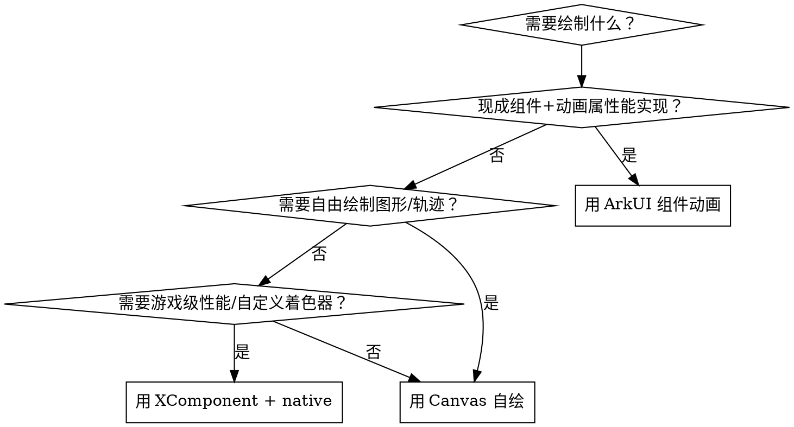

# Canvas 自绘、XComponent 原生渲染与图像处理

选型决策（成本从低到高）：



## 1. Canvas 自绘

适用：图表、轨迹动画、手写板、自定义进度环、频谱可视化等"图形形状由数据决定"的场景。

```ts
@Entry
@Component
struct CanvasDemo {
  // true = 开启抗锯齿
  private settings: RenderingContextSettings = new RenderingContextSettings(true);
  private context: CanvasRenderingContext2D = new CanvasRenderingContext2D(this.settings);

  drawFrame(progress: number): void {
    const ctx = this.context;
    ctx.clearRect(0, 0, ctx.width, ctx.height);
    ctx.beginPath();
    ctx.arc(150, 150, 100, -Math.PI / 2, -Math.PI / 2 + progress * Math.PI * 2);
    ctx.lineWidth = 12;
    ctx.strokeStyle = '#0A59F7';
    ctx.stroke();
  }

  build() {
    Column() {
      Canvas(this.context)
        .width('100%').height('100%')
        .onReady(() => this.drawFrame(0.75))
    }
  }
}
```

要点：

- 上下文：`CanvasRenderingContext2D`（直接在屏）/ `OffscreenCanvasRenderingContext2D`（离屏，复杂绘制先离屏再合成，避免闪烁）。
- **Canvas 动画驱动**：Canvas 自身只是画布，动画靠外部驱动重绘——用 `UIContext.createAnimator` 的 onFrame 每帧调 drawFrame(progress)，或状态变量驱动 onReady 外重绘。
- 绘制 API 是类 Web Canvas 2D 的命令式接口（path/arc/fill/stroke/drawImage/文本）。
- 简单几何图形也可以不用 Canvas：ArkUI 有 Shape/Path/Circle/Rect/Polygon 等绘制组件（见 `ui/arkts-geometric-shape-drawing.md`），它们可参与声明式动画，成本更低。

## 2. XComponent + Native 渲染（OpenGL ES / EGL）

适用：游戏级视效、3D 自研渲染、自定义着色器、相机预览合成特效等 Canvas 满足不了性能的场景。

**代价**：需要 C++/NAPI 工程，开发与调试成本高。确认 Canvas 真不够再上。

架构链路：

```
ArkTS 侧：XComponent 组件（持有 Surface）
   ↓ NAPI
Native 侧（C++）：注册 Surface 生命周期回调（创建/尺寸变化/销毁）+ 事件回调
   ↓
EGL 初始化 → OpenGL ES 渲染循环（或对接其他渲染引擎）
```

关键事实（2026-09 官方文档）：

- 组件自 API 8 起支持；**API 19+ 提供新接口** `XComponent(params: NativeXComponentParameters)`，Native 侧经此获取节点实例、注册回调。
- XComponent 的 `type` 决定 Surface 形态：`SURFACE`（独立缓冲，性能高）/ `TEXTURE`（参与合成）。
- 开发指南：OpenHarmony 文档仓库 `application-dev/ui/napi-xcomponent-guidelines.md`（自定义渲染 XComponent），含完整 C++ 侧 EGL 初始化示例。
- 需要 NDK 侧动画时另见 `ui/ndk-use-animation.md`。

工程层面：native 代码放 `entry/src/main/cpp/`（CMakeLists.txt + cpp 源码），`module.json5` 无需特殊声明，构建走 hvigor 的 native 编译。详见 project-build.md。

## 3. 图像处理：effectKit 与 uiEffect（别搞混）

| | effectKit | uiEffect |
|---|---|---|
| 定位 | **离线**处理图像源（pixelmap/png/jpeg） | **实时**组件效果，接入渲染管线处理帧缓存 |
| API 起始 | 9+ | 12+ |
| 核心接口 | `createEffect(pixelmap): Filter`、`ColorPicker` 智能取色、`Color` | `createFilter(): Filter`（模糊/边缘像素扩展/提亮，同类效果可**级联**）、`VisualEffect` |
| 典型场景 | 生成毛玻璃缩略图、主色调提取（音乐封面取色）、图片滤镜导出 | 组件级联动态滤镜、实时提亮、边缘光晕 |

```ts
import { effectKit, uiEffect } from '@kit.ArkGraphics2D';
import { image } from '@kit.ImageKit';

// effectKit：离线取主色调（如专辑封面取色做背景）
const pixelMap: image.PixelMap = /* 解码图片 */;
const colorPicker = await effectKit.createColorPicker(pixelMap);
// colorPicker.getMainColor() ...

// effectKit：离线滤镜链
const filter = effectKit.createEffect(pixelMap);
filter.blur(20).grayscale();
const result = await filter.getEffectPixelMap();

// uiEffect：实时组件效果（级联）
const liveFilter = uiEffect.createFilter();
liveFilter.blur(10).brightness(1.1);
// 应用到组件（具体挂载方式以最新文档为准）
```

**还有更轻的选择**：静态滤镜（灰度/亮度/饱和/反色/模糊/阴影）直接用小数点通用属性 `.grayscale(0.8)` `.brightness(1.2)` 等（见 arkui-animation.md 第 12 节），不需要动用这两个模块。

## 4. @kit.ArkGraphics2D 其他能力

- `drawing`：底层 2D 绘制 API（Brush/Pen/Path/ShaderEffect/ColorFilter/ShadowLayer 等），供深度定制绘制场景使用，参考 `apis-arkgraphics2d/arkts-apis-graphics-drawing-*.md`。
- `text`：文本排版底层能力。

## 常见坑

| 症状 | 原因 | 解法 |
|---|---|---|
| Canvas 动画撕裂/闪烁 | 直接在屏上下文复杂绘制 | 换 OffscreenCanvasRenderingContext2D |
| Canvas 不动 | 只在 onReady 画了一次 | 用 Animator onFrame 驱动每帧重绘 |
| 想用 effectKit 做实时模糊动画 | 选错模块（它是离线的） | 用 uiEffect，或 `.blur()` 属性 + animateTo |
| XComponent 黑屏 | EGL 初始化时序/Surface 回调未注册 | 对照 napi-xcomponent-guidelines.md 官方示例 |
