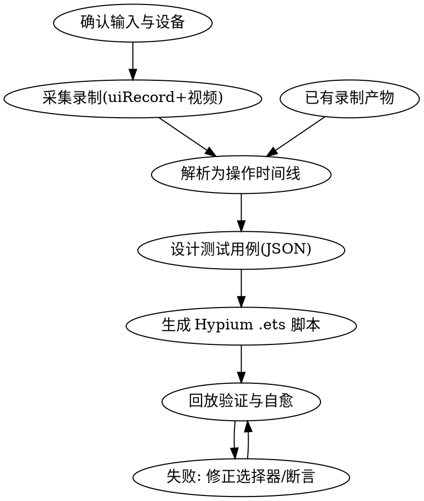

# 从录制操作生成 HarmonyOS Hypium UI 测试用例

## Overview

把"用户在 HarmonyOS 设备上的一段操作录制"转化为**可执行的 Hypium UiTest 测试用例**（ArkTS，`@ohos/hypium` + `@kit.TestKit`）。

**核心原则：用结构化事件流，而不是"看"视频。**

为什么：纯文本 LLM 没有视觉能力，从录屏画面反推操作（点了哪个控件、跳到哪页）既不可靠也不可验证。HarmonyOS 官方 UITest 工具提供 `hdc shell uitest uiRecord record`，录制时**系统自动输出每次操作的事件类型、坐标和命中的控件信息**（type/id/text/bounds/hierarchy）到 `record.csv`，配合 `-l` 选项还能保存每步操作的页面布局快照。这份结构化数据才是生成测试用例的可靠输入——选择器直接来自系统识别结果，不是模型臆想。

视频仍有价值（人工复核、补录 uiRecord 录不到的文本输入内容、观察 Toast/动画等瞬态），但它是**辅助证据，不是数据源**。

## Workflow



### Step 0 — 确认输入

先弄清用户处于哪种状态（缺失时问，不要猜）：

1. **有设备 + 未录制** → 走 Step 1 采集流程；
2. **已有录制产物**（record.csv / layout_*.json / 视频文件）→ 直接进 Step 2；
3. **只有视频、无法补录** → 明确告知：本 skill 依赖结构化事件流；可选降级方案是用多模态模型（如 GLM-5.3-Flash）先把视频转述成操作时间线，再回到 Step 2，但要标注"选择器置信度低，需真机校验"。

同时确认：被测应用包名（bundleName）、Ability 名（通常 `EntryAbility`）、测试工程位置（用例写到哪个工程的 `ohosTest/ets/test/`）。

### Step 1 — 采集录制（有设备时）

用 `scripts/record_session.sh` 一键采集（封装了下述 hdc 命令，含产物拉取）：

```bash
bash scripts/record_session.sh <输出目录> --layout
```

手工流程等价于：

```bash
# 1. 建议用户在开发者选项中打开「显示指针位置」——视频中可见触点坐标，便于人工复核
# 2. 开始录制操作事件（-l 每步存布局快照；-W 默认 true 记录命中控件信息）
hdc shell uitest uiRecord record -l
# 3. 用户在设备上操作被测应用；注意：每步操作后等命令行输出识别结果再进行下一步
# 4. Ctrl+C 结束录制，拉取产物
hdc file recv /data/local/tmp/record.csv <输出目录>/
hdc shell ls /data/local/tmp/ | grep layout_   # 找出本次录制的布局快照
hdc file recv <各 layout_*.json> <输出目录>/
```

**采集阶段必须告诉用户的要点：**

- 录制**不含文本输入内容**（官方支持事件：点击/双击/长按/拖拽/滑动/抛滑）——输入账号密码等场景，请用户操作时同步录屏或事后口述输入值；
- 操作节奏放慢：每步等终端打印识别结果再操作下一步，否则事件可能丢失或错位；
- 同步录屏（系统录屏或 AVScreenCapture）作为复核证据。

### Step 2 — 解析为操作时间线

用 `scripts/parse_uirecord.py` 把录制产物解析成规范化时间线 JSON：

```bash
python3 scripts/parse_uirecord.py \
  --record <输出目录>/record.csv \
  --layouts <输出目录>/ \
  --out timeline.json
```

输出格式（每个操作一项）：

```json
{
  "seq": 3,
  "action": "click",
  "bundle": "com.example.music",
  "ability": "com.example.music.EntryAbility",
  "start": {"x": 47, "y": 301},
  "end": {"x": 47, "y": 301},
  "duration_ms": 33,
  "widget": {"id": "btn_login", "text": "登录", "type": "Button",
             "bounds": "[37,280][118,361]", "hier": "ROOT,3,0,0,..."},
  "selector": {"strategy": "id", "on": "ON.id(\"btn_login\")"},
  "layout_snapshot": "layout_1727580000000_3.json",
  "warnings": []
}
```

**选择器决策规则（生成代码时严格遵守，这是防幻觉的核心）：**

1. `W1_ID` 非空 → `ON.id("...")`；
2. ID 为空但 `W1_Text` 非空 → `ON.text("...")`（注意 text 可能因文案变动失效，在用例注释中标注）；
3. 两者皆空 → `ON.type("...")` + 上下文约束（`.within(...)` 或索引），并在用例中标记「弱选择器，需人工确认」；
4. **绝不凭空发明控件 id/text**——所有选择器必须能在 record.csv 或 layout JSON 中找到出处；
5. 裸坐标 `driver.click(x, y)` 只作最后兜底（分辨率变化即失效），并在用例中标记风险。

解析器会对可疑缺口发出 warning（如：点击了 TextInput 后没有后续输入事件 → 提示"此处可能有未录制的文本输入，需向用户确认输入值"）。**遇到 warning 必须找用户确认或在用例中显式标注假设，不要自行编造输入内容。**

### Step 3 — 设计测试用例（JSON）

产出两份用例（格式见 `references/testcase-schema.md`）：

1. **正向用例**：直接由时间线切分。按"页面/功能语义"把连续操作分组（如"登录流程"= 输入账号+输入密码+点登录），每组一个用例；每步的预期结果从对应 layout 快照中提取（操作后出现的关键控件/文本）。
2. **推导用例**（体现 LLM 增量价值）：基于 layout 快照中的控件属性推导负向/边界场景——
   - 按钮初始 `enabled=false` → "前置条件不满足时按钮不可点"；
   - 输入框 `maxLength` → 超长输入边界；
   - 空列表/错误弹窗等路径录屏未覆盖 → 标注"推导用例，未经录屏验证"。

优先级标注：P0=录制演示的主流程，P1=推导的重要负向，P2=边界。

### Step 4 — 生成 Hypium UiTest 脚本

按 `references/hypium-uitest-api.md` 中的**官方骨架**生成 `.ets` 文件，要点：

- 导入固定为 `@ohos/hypium`（describe/it/expect/Level/TestType）与 `@kit.TestKit`（Driver/ON/Component）——**不要凭记忆发明 API**；如对某个接口没把握，先查本仓库 `research/raw/` 下缓存的官方文档或联网核实（HarmonyOS API 迭代快，老接口可能废弃）；
- 等待一律用 `driver.waitForComponent(ON..., timeout)` / `driver.waitForIdle(...)`，不用裸 `sleep`（录屏里的等待时长是环境噪音，不是断言依据）；
- 断言用 `expect(...).assertXxx()` 和 `driver.assertComponentExist(...)`；
- 每个用例一条 `it()`，测试名 = 用例 ID（如 `it('TC-LOGIN-001_login_success', ...)`），保持双向可追溯；
- 文件放入被测工程 `ohosTest/ets/test/`，并在 `ohosTest/ets/test/List.test.ets`（或对应 runner 配置）中注册。

### Step 5 — 回放验证与自愈

```bash
hdc shell aa test -b <bundleName> -m entry_test -s unittest OpenHarmonyTestRunner \
  -s class <suiteName> -s timeout 60000
```

- 全部通过 → 交付用例 JSON + .ets + 执行结果；
- 失败 → **先诊断再改**：选择器失效（对照失败时的 `uitest dumpLayout` 修正）、等待不足（加大 timeout 或换 waitFor 条件）、断言过严（对照 layout 快照修正预期）。修正记录写入用例的 `derivation` 字段，保持用例与录屏证据的溯源关系。

## 常见坑（先读再动手）

| 坑 | 后果 | 对策 |
|---|---|---|
| 把视频当数据源"看图写脚本" | 选择器全靠猜，脚本跑不起来 | 选择器只能来自 record.csv / dumpLayout |
| uiRecord 不含文本输入 | 登录/搜索用例缺输入值 | 采集时同步录屏或事后向用户确认；解析器 warning 不可忽略 |
| 用裸坐标回放 | 换设备/分辨率即失败 | 坐标仅兜底，优先 id/text 选择器 |
| 裸 sleep 等待 | 弱网/慢机上用例 flaky | `waitForComponent`/`waitForIdle` |
| 凭记忆写 @ohos.* 老 API | 编译失败 | 以 references/hypium-uitest-api.md 骨架为准，不确定先查官方文档 |
| 录制时操作过快 | 事件丢失、时序错乱 | 每步等识别输出再操作 |

## 文件说明

- `scripts/record_session.sh` — 采集封装（启动 uiRecord、提示操作、Ctrl+C 收尾、拉取 record.csv 与 layout 快照）
- `scripts/parse_uirecord.py` — 解析 record.csv(+layout) 为规范化时间线 JSON，输出选择器建议与缺口 warning
- `references/uirecord-format.md` — uiRecord 命令参数、record.csv 字段、dumpLayout 结构、官方文档出处
- `references/hypium-uitest-api.md` — Hypium/UiTest 官方用例骨架、匹配器/操作/等待/断言速查、执行命令
- `references/testcase-schema.md` — 用例 JSON 的结构约定与示例
