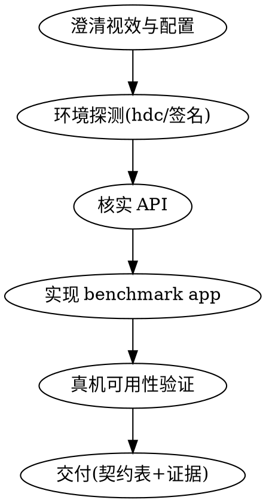

# HarmonyOS 原子视效 Benchmark App 开发

## Overview

开发鸿蒙**原子视效 benchmark app**：单视效、demo 级、确定性的最小应用，
并用真机（hdc）验证其可用性。需要参数扫描时可启用外部参数注入（扩展项）。

**职责边界（重要）**：

- ✅ 本 skill 只做：benchmark **app 本体** + **可用性验证**（编译/安装/启动/渲染可见，含参数生效核对——若启用扩展 A）
- ❌ 本 skill 不做：跑测编排、参数扫描驱动、指标采集（FPS/CPU/GPU/内存）、数据建模——这些在你的外部工具链

为什么严格分离：app 是**被测对象**。测量逻辑放进 app 会污染被测负载；
负载数据是否可信，首先取决于被测 app 本身是否干净、确定。

**核心原则仍然成立：先搜索，后编码。** HarmonyOS API 迭代极快，每次开发前必须联网核实
（全局 `animateTo` 已废弃、模块级 `animator.create()` API 18 废弃、`pageTransition` 不推荐……
这些已核实的陷阱见 references/arkui-animation.md，新 API 仍需按 references/search-sources.md 核实）。

## Benchmark App 契约

**核心契约（四条，必须全满足）**——违反任何一条，产出的负载数据就不可信；
每条都在 references/benchmark-app.md 有详细实现模板：

1. **原子性**：一个 app 只测一种视效。场景固定，无无关动画、无装饰性转场、无网络内容。
2. **确定性**：固定视口、固定随机种子、固定时间步长——同一配置多次启动，渲染行为逐帧一致。
3. **可观测最小集**：仅打生命周期日志（hilog，统一 tag），供外部工具对齐采样窗口；
   **不内置任何测量/统计逻辑**（测量归外部工具）。
4. **可验证**：交付前真机过一遍——装得上、起得来、渲染可见（截图）。

**扩展项（按需启用）**：

- **扩展 A：参数外部驱动**——仅当该 benchmark 需要**参数扫描**时实现
  （Step 0 判断）。实现方式：关键参数经 Ability Want 启动参数注入
  （`hdc shell aa start -b <bundle> -a <ability> --pi <key> <int> --ps <key> <string>`），
  app 内解析、类型校验、给默认值；UI 调参只能是手动调试辅助。
  完整模板与参数契约表见 **references/ext-param-injection.md**。
  固定配置的压测 app（如「满屏 blur radius=50 持续渲染」）不需要它，保持最小实现。

## Workflow



### Step 0 — 澄清视效与配置

确认四件事（缺失时问用户，不要猜）：

1. **原子视效**：哪一种？（粒子/模糊/转场/Canvas 对象/着色器……一次一种）
2. **是否需要参数扫描**（决定是否启用**扩展 A**）：
   - 需要 → 与用户确认参数契约：键名、类型、范围、默认值、建议步长
     （如 `particle_count: int, 100–2000, 默认 500, 步长建议 ×2 几何级数`）。
     这份契约最终要交付给跑测脚本作者——键名一旦确定就不要改。
   - 不需要（固定配置压测）→ 跳过扩展 A，app 保持最小实现。
3. **固定场景**：视口尺寸、背景、静态元素——所有非被测变量。
4. **设备与签名**：目标设备型号？是否已在 DevEco Studio 配置过签名？

### Step 1 — 环境探测

skill 主体运行在 **Windows**（PowerShell / CMD）：

```powershell
where.exe hvigorw ohpm hdc                              # PowerShell 必须写全 where.exe（裸 where 是 Where-Object 别名）
hdc list targets                                        # 真机在线才有输出
dir "$env:LOCALAPPDATA\OpenHarmony\Sdk"                 # SDK 常见位置（Windows）
dir "C:\Program Files\Huawei\DevEco Studio"             # DevEco Studio 默认安装目录
```

（macOS/Linux 环境等价物：`which hvigorw ohpm hdc`、`~/Library/OpenHarmony/Sdk`、`/Applications/DevEco-Studio.app`，探测逻辑相同。）

- 无 hdc/设备 → 仍产出完整工程，但验证步骤降级为「文档化命令链 + 请用户在真机执行」，
  并在交付中明确标注哪些验证未实际执行。
- 有设备但编译产物未签名 → 提示用户在 DevEco Studio 开一次自动签名
  （File → Project Structure → Signing Configs），或复用其既有签名工程配置。

### Step 2 — 核实 API（不可跳过，三级按序）

**核实原则：先查本地，后联网。** 归档文档和 SDK 声明都在本机，离线零延迟。

1. **归档官方文档**（`references/api-docs/`，73 份视效相关官方文档的离线快照，
   索引见 `api-docs/INDEX.md`）：编码所需的接口签名、参数说明、官方示例直接在这里查。
   **注意：归档是官方全文，单文件可达 200KB+。必须定位式阅读**——用
   `Select-String -Pattern "<接口名>" -Context`（Windows）或 `grep -n` 拿行号再按需读
   （macOS/Linux）锁定目标小节，禁止全文读入大文件。
2. **本地 SDK 声明**（`ets/api/*.d.ts` 与 NDK 头文件，探测方法见 search-sources.md 第 0 节）：
   **版本对齐裁决者**——归档与 SDK 冲突时以 SDK 为准（它决定编译成败）。
3. **联网**（方法见 search-sources.md）：仅用于归档未覆盖的内容——新接口、
   商业 Kit（如 SceneKit）、最新工程模板。归档已是 master 快照，多数情况用不到这层。

工具链命令已核实：`hdc shell aa start -b <bundle> -a <ability> [--pi k v] [--ps k v]`
（归档 `tools/aa-tool.md`；注意 `--pi` 仅无符号整型、`--wl/ww` 系列仅 2in1 设备生效）。

### Step 3 — 实现 benchmark app

按 **references/benchmark-app.md** 的模板实现核心契约（需要参数扫描时再读 references/ext-param-injection.md）；视效本身的实现参考选型表：

| 原子视效 | 技术 | 参考文件 |
|---|---|---|
| 粒子（数量/区域/速度扫描） | `Particle` 组件 | references/arkui-animation.md |
| 属性动画负载（N 个组件同时动画） | `animation` / `getUIContext().animateTo` | references/arkui-animation.md |
| 帧动画/自驱渲染 | `getUIContext().createAnimator` | references/arkui-animation.md |
| 模糊（半径/样式扫描） | `blur` / `foregroundBlurStyle` / `backdropBlur` / `motionBlur` | references/arkui-animation.md |
| 转场/共享元素 | `transition`+`TransitionEffect` / `geometryTransition` | references/arkui-animation.md |
| Canvas 自绘（对象数/路径复杂度扫描） | `CanvasRenderingContext2D` | references/canvas-xcomponent.md |
| 着色器/重渲染 | `XComponent` + OpenGL ES（成本高，先确认 Canvas 不够） | references/canvas-xcomponent.md |
| 3D / Lottie | SceneKit / `@ohos/lottie`（先联网核实版本） | references/3d-lottie.md |

工程结构与构建配置见 references/project-build.md。

### Step 4 — 真机可用性验证（交付前必做）

```powershell
hvigorw assembleHap --mode module -p product=default --no-daemon   # 编译（Windows 为 hvigorw.bat，直接输 hvigorw 即可）
hdc install -r entry\build\default\outputs\default\entry-default-signed.hap
hdc shell aa start -b <bundle> -a EntryAbility --pi particle_count 500
hdc shell hilog | findstr VFXBENCH        # Windows CMD 用 findstr；PowerShell 用 Select-String；macOS/Linux 用 grep
hdc shell snapshot_display -f /data/local/tmp/bench.jpeg
hdc file recv /data/local/tmp/bench.jpeg .\verify-default.jpeg
# 换一组参数重复启动+截图，确认参数驱动生效
```

每步的通过标准与故障排查见 references/benchmark-app.md 的验证清单。
**没有截图证据不得声称「渲染正常」**——装得上不等于渲得出。

### Step 5 — 交付

1. 工程（可直接 DevEco Studio 打开）
2. **参数契约表**（启用扩展 A 时）：键名 / 类型 / 范围 / 默认值 / 建议步长（给跑测脚本作者的接口文档）
3. **验证证据**：编译结果、安装输出、日志摘录（启用扩展 A 时含参数回显）、不同配置下的截图
4. **复现命令链**：从编译到启动的完整命令（用户的外部脚本直接参考）

## Common Mistakes

| 错误 | 后果 | 正确做法 |
|---|---|---|
| （启用扩展 A 时）参数硬编码在 build() / 常量里 | 外部脚本无法驱动，benchmark 报废 | Want 启动参数注入（扩展 A，见 ext-param-injection.md） |
| （启用扩展 A 时）只做 UI 滑块调参 | 批量跑测无法无人值守 | UI 仅辅助，Want 为主入口 |
| 固定配置压测也硬塞参数注入 | 无谓复杂度，违背最小实现 | 不需要扫描就不启用扩展 A |
| 随机粒子/随机颜色无种子 | 同配置多次运行数据不可比 | 固定种子或确定性伪随机 |
| 动画用帧率相关步长（每帧 +1px） | 不同帧率下运动速度不同，污染负载-参数关系 | 固定 timestep（按时间戳推进） |
| app 内置 FPS/CPU 测量 | 测量逻辑污染被测负载 | 测量归外部工具（核心契约 3） |
| 场景混入装饰性动画/转场 | 测到的不只是目标视效 | 原子性（核心契约 1），无关元素全部静态 |
| 凭记忆写视效 API | 全局 animateTo / animator.create / pageTransition 等已废弃 | Step 2 核实 + arkui-animation.md 陷阱表 |
| 验证只到「安装成功」 | 白屏/崩溃都不知道 | 走完验证清单，截图为证 |

## Quick Reference

```powershell
# 环境与设备（Windows）
where.exe hvigorw ohpm hdc; hdc list targets

# 编译与安装
hvigorw assembleHap --mode module -p product=default --no-daemon
hdc install -r entry\build\default\outputs\default\entry-default-signed.hap

# 带参启动（int/string/bool/null 四类参数；aa start 单行书写，CMD/PowerShell 不支持 \ 续行）
hdc shell aa start -b com.example.vfxbench -a EntryAbility --pi particle_count 1000 --ps scene storm --pb fixed_seed true

# 观测与取证（PowerShell 把 findstr 换成 Select-String；macOS/Linux 用 grep）
hdc shell hilog | findstr VFXBENCH
hdc shell snapshot_display -f /data/local/tmp/shot.jpeg
hdc file recv /data/local/tmp/shot.jpeg .

# 清理
hdc shell aa force-stop com.example.vfxbench
hdc uninstall com.example.vfxbench
```

## References 导读

| 文件 | 何时读 |
|---|---|
| references/benchmark-app.md | **每次必读**：核心契约四条实现模板、hilog 规范、验证清单 |
| references/ext-param-injection.md | **仅当需要参数扫描时读**（扩展 A）：Want 注入模板、参数契约表模板 |
| references/api-docs/INDEX.md | **编码时查接口细节**：73 份官方文档离线归档（签名/参数/示例），索引按主题检索 |
| references/search-sources.md | 需要 SDK 声明探测方法、或归档未覆盖需联网时 |
| references/arkui-animation.md | 视效涉及 ArkUI 动画/粒子/转场/模糊时（地图+陷阱速查） |
| references/canvas-xcomponent.md | 视效涉及 Canvas / XComponent / 着色器时 |
| references/3d-lottie.md | 视效涉及 3D / Lottie 时 |
| references/project-build.md | 新建工程、构建配置、签名、编译排错时 |

维护：归档快照过期时用 `scripts/refresh_api_docs.py` 刷新。
